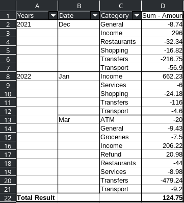



1. Select your whole table including headers

2. With your table selected, go to **Data > Pivot Table > Insert or Edit...**
3. Select **Current selection** for **Selection** then click **OK**
4. On this page, you can drag the available fields to any box you want (Filters, Column, Row and Data). For what I am doing I will drag my headers into these boxes and click **OK**:

This will create a new sheet by default with this:



**Now we will group the dates by month and year, but feel free to group them however you like.**

1. Click the first cell under the filtering box (in this case A2) and go to **Data > Group and Outline > Group** (or press F12).
2. We can keep everything default, except I am going to make sure **Months** and **Years** is selected under **Intervals** in the **Group by** section and click **OK**:

**This is what your pivot table should now look like** (I added more data):



- If you right click anywhere on your table and go to properties, you can tweak your table.

- Double clicking fields (in this case, like Amount, Category, etc) allows you to modify how their values are presented.

- You can go under **Source and Destination** to increase the source selection range which will allow you to include more rows, if you add them down the line.

- To update the data displayed in your pivot table you can **right click > refresh** on it.
